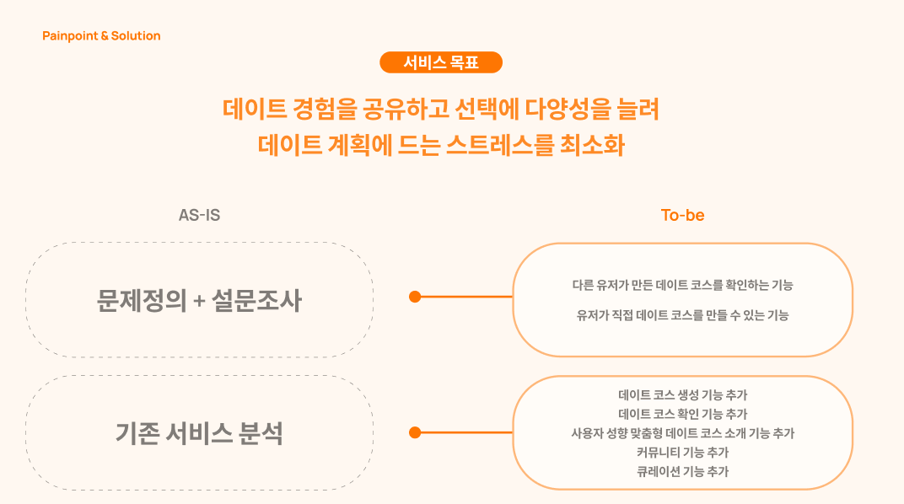
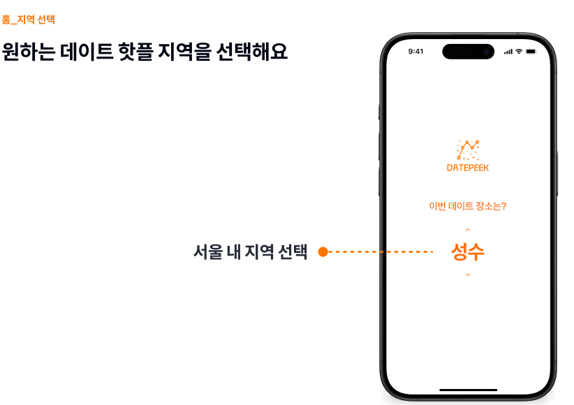
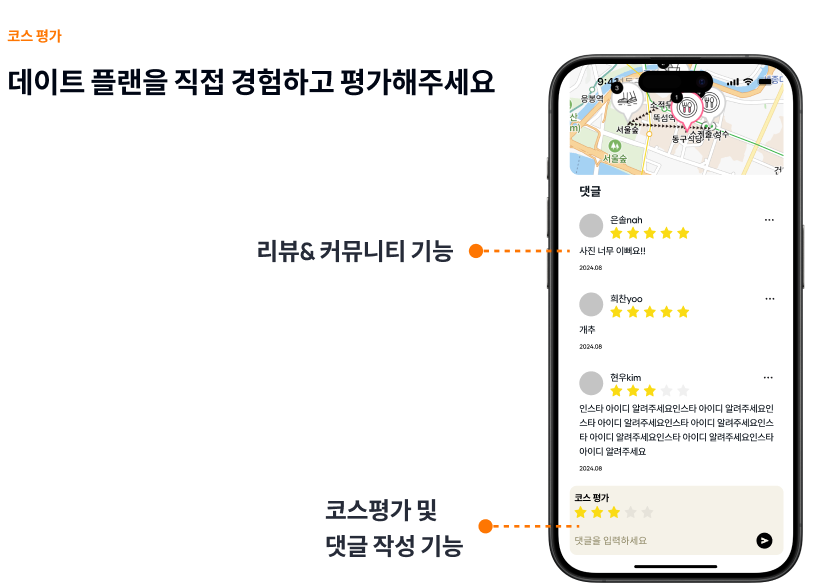
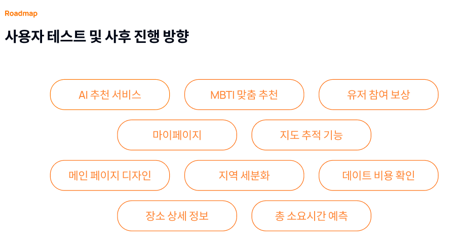

# DATEPEEK: 지역 기반 데이트 스팟 공유 서비스

**DATEPEEK**는 데이트 코스를 찾는 데 불편함을 해결하기 위한 서비스입니다.  
이 서비스는 사용자가 직접 데이트 코스를 만들고, 다른 유저와 공유할 수 있는 플랫폼을 제공합니다.  
다양한 데이트 경험을 공유하며 선택의 폭을 넓혀 데이트 계획의 스트레스를 최소화하는 것이 서비스의 목표입니다.


## 팀 구성 및 개발 일정

- 팀원: 프론트엔드 1명(sooooooool), 백엔드 1명(yeyeyey), 기획 3명  
- 개발 기간: 2024.08.02 ~ 2024.09.30


## 서비스 목표

- DATEPEEK는 사용자의 데이트 경험을 공유하고 다양한 데이트 코스를 제공하여, 데이트 계획에 드는 고민과 스트레스를 줄여줍니다.




## 주요 기능 및 서비스 화면

### 지역 선택

사용자가 원하는 데이트 핫플 지역을 선택할 수 있는 기능을 제공합니다.



### 데이트 코스 확인

다른 사용자가 작성한 데이트 코스를 확인할 수 있으며, 관련된 정보를 제공합니다.


### 코스 상세 페이지

상세 페이지에서 코스의 이미지, 정보, 경로 등을 확인하고, 댓글로 다른 사용자와 소통할 수 있습니다.


### 사용자 평가

직접 경험한 데이트 코스에 대한 별점 평가와 댓글을 작성할 수 있습니다.



### 코스 만들기

사진 업로드, 제목 작성, 관련 스팟 선택 등의 기능을 통해 나만의 데이트 코스를 만들 수 있습니다.


## 프로젝트 차후 진행 방향

프로젝트의 진행 방향은 다음과 같습니다:




## 프로젝트 구조

### 폴더 구조

```bash
📦src/
├── 📂components/            # 재사용 가능한 UI 컴포넌트 모음
│   ├── 📂Layout/            # 레이아웃 관련 컴포넌트
│   ├── 📂Spot/              # 스팟 관련 컴포넌트
│   ├── 📂Course/            # 코스 관련 컴포넌트
│   ├── 📂Comment/           # 댓글 관련 컴포넌트
│   └── 📂Common/            # 공통 UI 컴포넌트
├── 📂hooks/                 # 커스텀 훅 모음
├── 📂pages/                 # 페이지 컴포넌트 모음
├── 📂routes/                # 라우트 정의
├── 📂services/              # API 호출 및 서비스 로직
├── 📂types/                 # 타입 정의 모음
└── App.tsx                  # 메인 App 컴포넌트

```


## 설치 및 실행

### 1. 패키지 설치
프로젝트 루트 디렉토리에서 다음 명령어를 치세요.
- npx create-react-app . --template typescript
- npm i / npm start

## Learn More

You can learn more in the [Create React App documentation](https://facebook.github.io/create-react-app/docs/getting-started).
To learn React, check out the [React documentation](https://reactjs.org/).

##  GIT 규칙 - commit, branch

### Commit 규칙

- **`타입(태그)`**: 커밋의 성격을 간결하게 나타냅니다.
- **`주제`**: 변경 사항을 요약합니다 (50자 이내).
- **`본문`**: 선택 사항으로, 커밋에 대한 추가 설명이나 이유, 세부사항을 포함할 수 있습니다. 본문은 한 줄 비워둔 뒤 작성하며, 각 줄은 72자를 넘지 않도록 합니다.
- **`이슈 번호`**: 관련된 이슈 번호를 명시합니다 (있을 경우).


### 커밋 메시지 타입(태그)

- **`feat`**: 새로운 기능 추가 (예: feat: Add payment processing module)
- **`fix`**: 버그 수정 (예: fix: Correct user login issue)
- **`refactor`**: 코드 리팩토링 (기능 변화 없음) (예: refactor: Optimize API response handling)
- **`style`**: 코드 스타일 수정 (포매팅, 세미콜론 추가 등) (예: style: Reformat code according to ESLint rules)
- **`docs`**: 문서 수정 (예: docs: Update API documentation for v2.0)
- **`test`**: 테스트 코드 추가 또는 수정 (예: test: Add unit tests for user service)
- **`chore`**: 빌드 또는 개발 도구 관련 작업 (예: chore: Update dependencies)
- **`perf`**: 성능 개선 (예: perf: Improve query performance for large datasets)
- **`ci`**: CI 설정 수정 (예: ci: Update GitHub Actions configuration)
- **`revert`**: 이전 커밋 되돌리기 (예: revert: Revert "feat: Add payment processing module")

### Git-flow 전략에 따른 커밋 예시
  
 **Feature 브랜치 작업**:
 - `feat`: Implement user registration form
 - `feat`: Add password validation logic

 **Bugfix 작업**:
 - `fix`: Resolve issue with login redirection
 - `fix`: Correct API endpoint path

  **Release 브랜치에서 버전 준비**:
 - `chore`: Prepare version 1.2.0 release
 - `docs`: Update CHANGELOG for 1.2.0 release

  **Hotfix 작업**:
 - `fix`: Critical bug in production environment
 - `revert`: Revert faulty migration script

 
### 커밋 메시지 작성 시 Best Practices
- **`작은 커밋`**: 커밋을 자주, 작은 단위로 나누어 기록합니다. 각 커밋은 독립적으로 이해될 수 있어야 합니다.
- **`의미 있는 메시지`**: 커밋 메시지는 코드 변경 내용만이 아닌, 변경의 이유도 설명해야 합니다.
- **`현재 시제 사용`**: 커밋 메시지는 현재 시제로 작성합니다. 예: "Added" 대신 "Add".
- **`관련 이슈 참조`**: 관련된 이슈 번호를 명시하여 변경 사항과 이슈를 연결합니다.

### 규약 준수
모든 팀원은 이 규칙을 준수하여 일관된 Git 커밋 메시지를 작성해야 하며, 이를 통해 프로젝트 관리와 협업이 원활하게 진행될 수 있도록 노력합니다. 규칙을 준수하지 않을 경우, 코드 리뷰에서 지적되어 수정 요청을 받을 수 있습니다.

### 이 규약은 팀 프로젝트의 성공적인 진행을 위해 만들어졌으며, 모든 팀원은 이를 숙지하고 준수해야 합니다.


## 팀 프로젝트 개발자 회고 및 인사이트

### 1. 프로젝트 경험 및 회고

#### 시간 제약과 설계 영향

기획이 완료된 후 작업을 시작했더라면 더욱 효율적인 구조를 설계할 수 있었으나, 짧은 시간으로 인해 아쉬움이 남습니다.

#### API 통합 작업의 중요성

프론트엔드와 백엔드의 API 연결이 예상보다 오래 걸렸습니다. API 통합 작업의 중요성을 깨닫게 되었습니다.

### 2. 기술적 인사이트

#### REST API 명세서의 중요성

상세한 API 명세서 작성은 데이터 처리의 정확도를 높여줍니다.

#### 배포 환경 설정의 중요성

통합적인 배포 환경 관리가 필요합니다.

